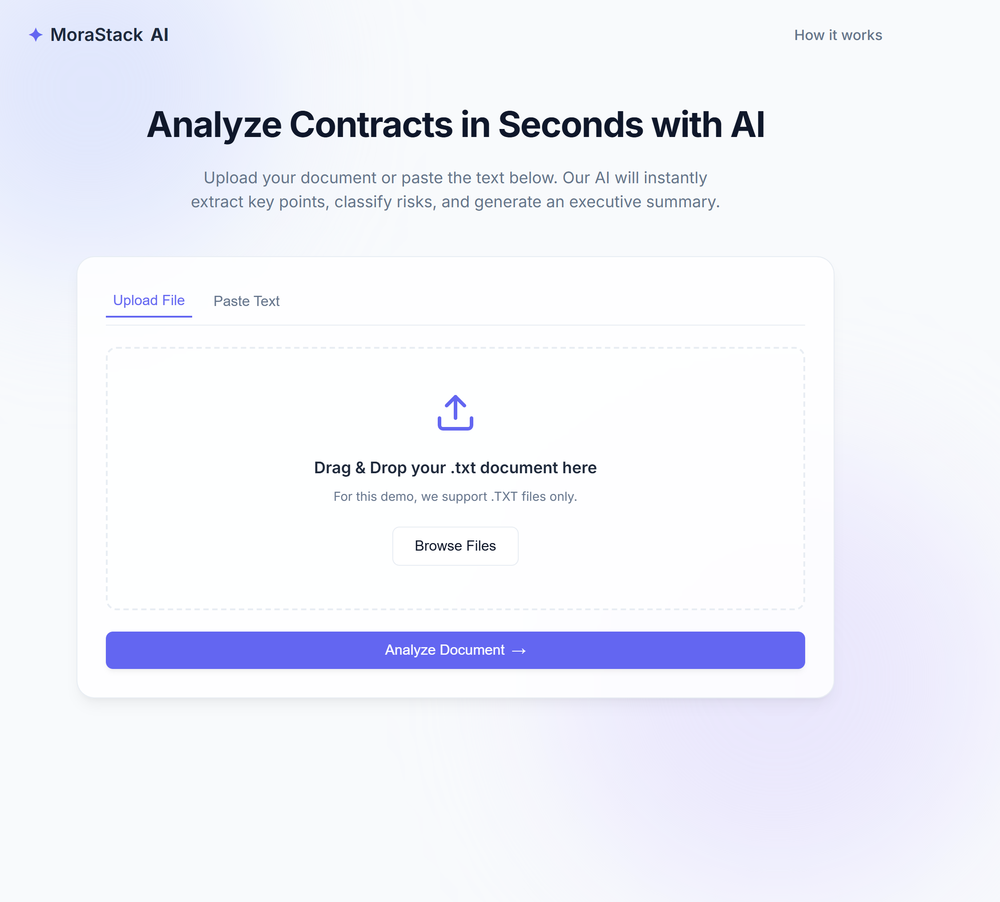
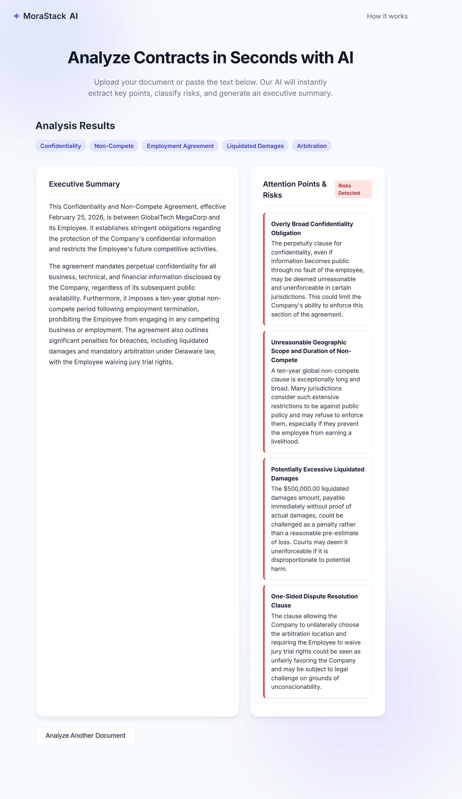

<div align="center">
  <h1>📄 Smart AI Document Analyzer</h1>
  <p>A full-stack web application that leverages Google's Gemini AI to instantly analyze contracts, legal documents, and long texts, extracting key insights and flagging potential risks.</p>
  
  <p>
    
    
    
    
  </p>
</div>

---

## 🚀 Live Demo
**Check out the live application here:** [Insert your Render link here]

---

## 📸 Project Interface

> **Note:** Here is a sneak peek of the application.

<p align="center">
  
</p>

<p align="center">
  
</p>

---

## ✨ Key Features

- **🧠 AI-Powered Insights:** Uses the `gemini-2.0-flash` model to read and understand complex documents in seconds.
- **🎯 Structured Output Generation:** The AI is strictly prompted to return valid JSON, ensuring reliable data mapping for the UI (Tags, Executive Summary, and Risk Classification).
- **📂 Intuitive Drag & Drop:** Users can seamlessly upload `.txt` files or directly paste text into the browser.
- **⚡ Asynchronous Processing:** Smooth frontend experience with loading states and modern UI/UX design.
- **🌐 Full-Stack Integration:** A robust Python/Flask backend communicating securely with a Vanilla JavaScript frontend via REST API.

---

## 🛠️ Tech Stack

**Frontend:**
- HTML5 & CSS3 (Custom variables, responsive layout)
- Vanilla JavaScript (DOM manipulation, Fetch API, asynchronous handling)

**Backend:**
- Python 3
- Flask & Flask-CORS
- Google GenAI SDK

**Deployment:**
- Hosted on **Render** (Gunicorn WSGI server)

---

## ⚙️ How to Run Locally

If you want to test this project on your local machine, follow these steps:

1. **Clone the repository:**
   ```bash
   git clone https://github.com/JonhSilverio/ai-document-analyzer.git
   cd ai-document-analyzer
   
2. Create a virtual environment (optional but recommended): 
``` bash
python -m venv venv
source venv/bin/activate  # On Windows use: venv\Scripts\activate
```

3. Install dependencies:
```bash
pip install -r requirements.txt
```

4. Set up your environment variables:
Create a .env file in the root directory and add your Google Gemini API key:

```Snippet de código
Snippet de código
GEMINI_API_KEY=your_api_key_here
```

5. Run the Flask application:

```bash
python app.py
```

About the Developer
Built with a focus on solving real-world business problems through AI automation and clean code architecture. Open for freelance opportunities and full-stack development roles.
   
